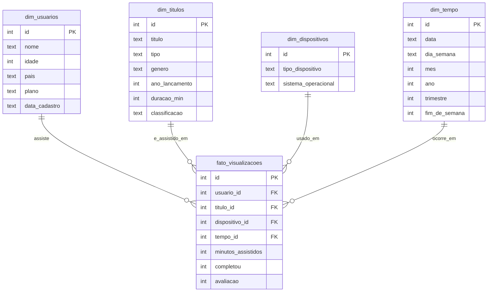

# Streaming SQL Portfolio
 
Banco de dados relacional em **SQLite**, modelado em **esquema estrela (star schema)**, simulando o histórico de visualizações de uma plataforma de streaming de filmes e séries. Projeto construído para demonstrar modelagem de dados, automação de geração de dados, consultas analíticas em SQL e visualização de indicadores.
 
## Modelo de dados
 
Esquema estrela com 1 tabela fato e 4 tabelas dimensão:
 

 
## Estrutura do projeto
 
```
streaming-sql-portfolio/
├── schema.sql                 # Definição das tabelas (DDL)
├── create_database.py         # Cria o banco a partir do schema.sql
├── seed_data.py                # Popula os dados (com desequilíbrios propositais)
├── adicionar_visualizacao.py    # Formulário no terminal p/ adicionar visualizações manualmente
├── consultas.sql                 # 10 consultas de análise
├── run_consultas.py               # Exibe o resultado das consultas no terminal
├── gerar_dashboard.py               # Gera o painel visual (dashboard.html)
├── dashboard.html                    # Painel com KPIs e gráficos (Chart.js)
├── streaming.db                        # Banco SQLite já criado e populado
├── .gitignore
└── README.md
```
 
## Sobre os dados
 
Os dados são gerados sinteticamente, mas de forma **propositalmente desequilibrada**, para se aproximar do comportamento de dados reais de streaming:
 
- Poucos títulos concentram a maioria das visualizações (distribuição tipo Zipf/cauda longa)
- Usuários premium assistem, em média, mais que usuários free
- Celular é o dispositivo mais usado, console é o mais raro
- Fins de semana têm mais audiência que dias úteis
- Há uma tendência de crescimento de audiência ao longo do período simulado
Volume base de dados: 20 usuários, 30 títulos, 5 dispositivos, 197 dias e **650 visualizações** (esse número cresce se você usar o `adicionar_visualizacao.py` para registrar novas sessões manualmente).
 
## Como rodar
 
Pré-requisito: Python 3 (já vem com suporte a SQLite embutido, não precisa instalar nada extra).
 
```bash
# 1. Cria o banco e popula com dados
python3 seed_data.py
 
# 2. Roda as 10 consultas analíticas e imprime os resultados no terminal
python3 run_consultas.py
 
# 3. Gera o painel visual (dashboard.html) com KPIs e gráficos
python3 gerar_dashboard.py
 
# 4. (opcional) Adiciona uma nova visualização manualmente, via formulário no terminal
python3 adicionar_visualizacao.py
```
 
O `seed_data.py` recria as tabelas do zero a cada execução (usa `random.seed(42)`, então os dados gerados são sempre os mesmos — reprodutível). Depois de rodar `adicionar_visualizacao.py`, rode `gerar_dashboard.py` de novo para o painel refletir os dados mais recentes — o `dashboard.html` é uma "fotografia" do banco no momento em que foi gerado, não atualiza sozinho.
 
## Exemplos de consultas incluídas
 
O arquivo `consultas.sql` cobre: `JOIN`, `GROUP BY` composto, `HAVING`, subqueries, e window functions (`RANK()`, `ROW_NUMBER() OVER PARTITION BY`). Alguns exemplos:
 
- Top 5 títulos mais assistidos
- Ranking de usuários por minutos assistidos
- Taxa de conclusão por tipo de dispositivo
- Evolução mensal de audiência
- Usuário mais ativo dentro de cada plano de assinatura
- Usuários que assistem acima da média geral
## Painel visual (dashboard.html)
 
Gerado automaticamente a partir do `streaming.db`: KPIs em destaque (total de visualizações, título mais assistido, taxa de conclusão média, usuário mais ativo) e 6 gráficos (top títulos, evolução mensal, dispositivos, taxa de conclusão por dispositivo, gênero, fim de semana vs dia de semana). É um arquivo HTML único — abre direto no navegador, sem precisar de servidor.
 
## Adicionando dados manualmente
 
O `adicionar_visualizacao.py` é um formulário interativo no terminal para registrar novas visualizações sem escrever SQL na mão: permite selecionar uma conta já existente ou cadastrar um novo usuário na hora, filtra os títulos por gênero, e usa automaticamente a data do dia em que o formulário é respondido.
 
## 💡 Insight interessante encontrado nos dados
 
Na consulta de ranking de usuários, o usuário com **mais minutos assistidos no geral é do plano free**, à frente de vários assinantes premium — mostrando que engajamento individual pode superar a tendência média por plano. Um bom exemplo de como a análise revela padrões que a intuição sozinha não prevê.